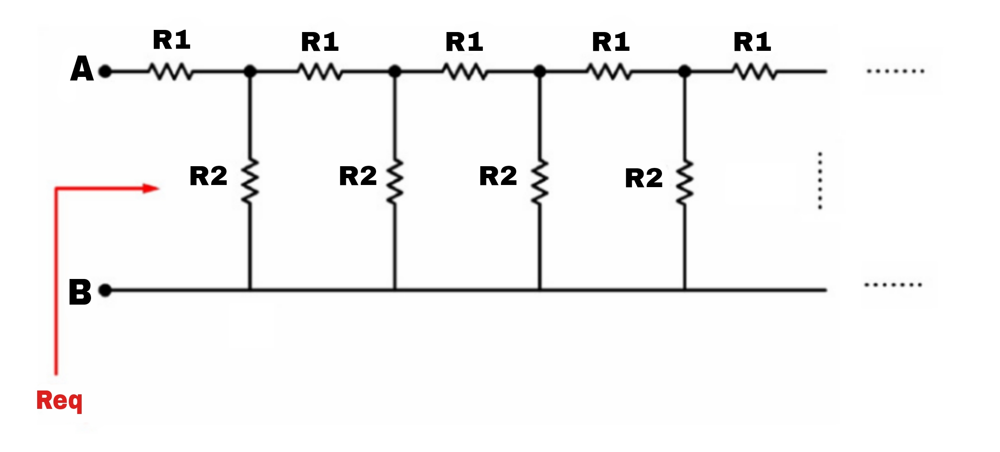

# infinite-ladder-network-resistance
## Overview



This repository contains three different Python scripts to calculate the equivalent resistance of an infinite ladder network, using three distinct approaches:

1. Iterative Loop Approach (loop.py)
2. Recursive Approach (recursive.py)
3. Quadratic Equation Approach (quadratic.py)
\
Each script takes two resistor values R1 and R2 as inputs and calculates the equivalent resistance of the infinite ladder network using its respective method.

- #### inputs:

    - ```R1```: Resistance value of resistor 1.
    - ```R2```: Resistance value of resistor 2.


- #### Output:
The equivalent resistance R_eq of the infinite ladder network.

## Files

### loop.py

This script implements an iterative loop to approximate the equivalent resistance.

- #### Method:
The script repeatedly updates an initial guess for the equivalent resistance using the formula:


$$
R_{eq} = R_1 + \frac{R_2 \times R_{eq}}{R_2 + R_{eq}}
$$

The iteration continues until the difference between successive values of ```R_eq``` is smaller than a specified tolerance (```1e-6``` by default), or a maximum number of iterations is reached.


### recursive.py

This script implements a recursive solution for the calculation of the equivalent resistance.

- #### Method:
The script uses recursion to model the infinite network, assuming that after enough recursions, the resistance will converge to a final value. A base case is defined when 500 iterations are reached (considered sufficient for convergence).

### quadratic.py

This script solves the equivalent resistance using a quadratic equation.

- #### Method:
By rearranging the equation for the infinite ladder network, the problem can be reduced to solving a quadratic equation:

$$
R_{eq}^2 - R_1 \times R_{eq} - R_1 \times R_2 = 0
$$

The quadratic formula is used to find the two possible solutions, and the positive one is selected as the equivalent resistance.


## 🚀 About Me
- [@nforoutann](https://github.com/nforoutann)
I'm a Computer Engineering (Computer Science) student at Shahid Beheshti University, passionate about technology, a lifelong learner, and professional nerd.

